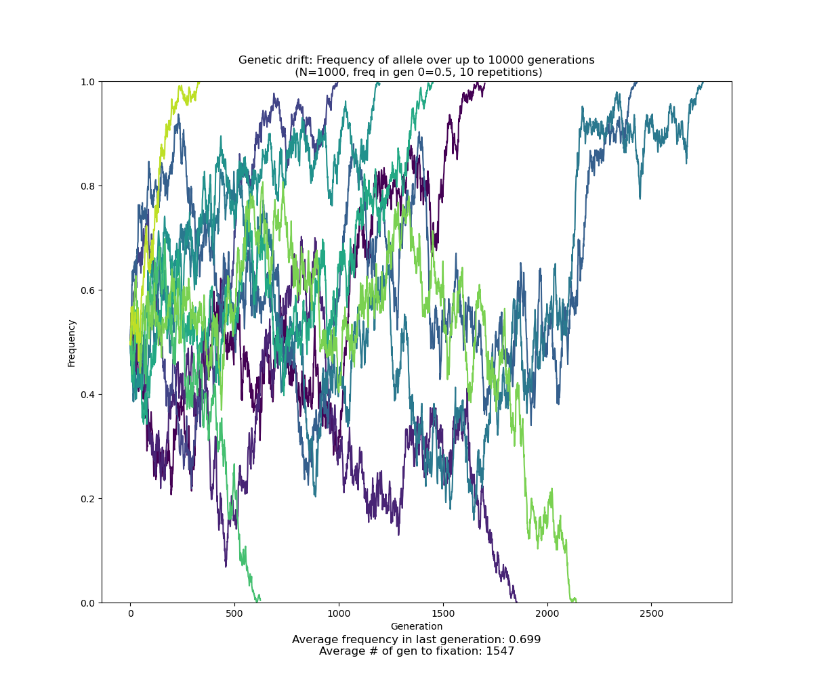
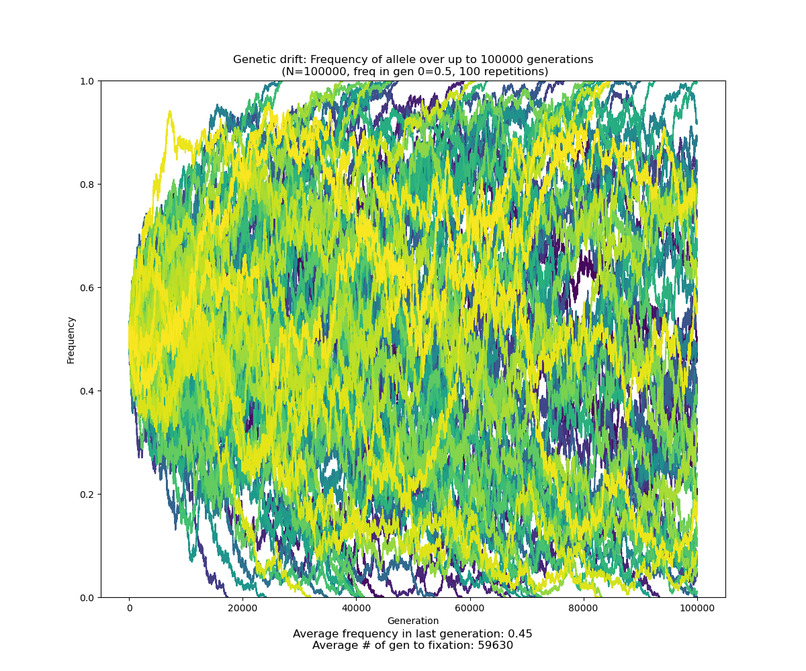
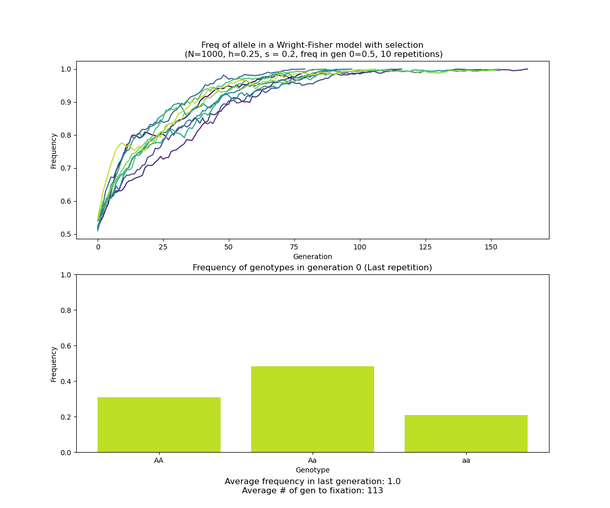
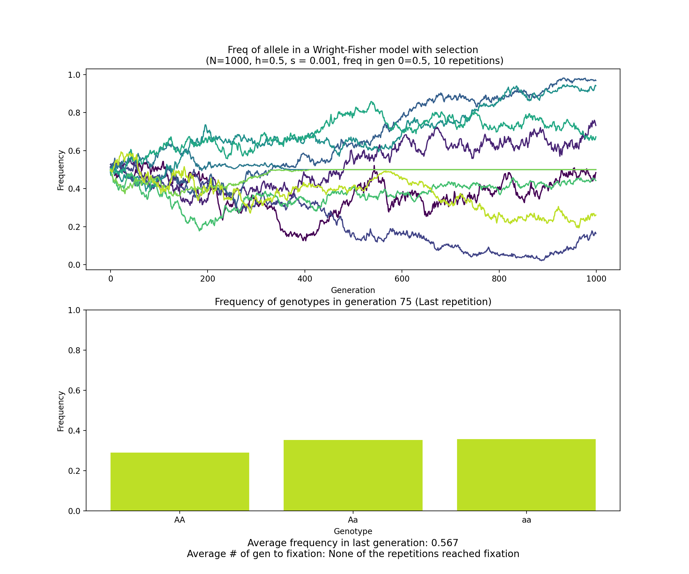

# Genetic drift simulator
### Julio Ayala
### Lund University, final project for the BINP16 course (Bioinformatics: Programming in Python)

#### 2020.10.30
https://github.com/julioaayala/genetic_drift

---
Genetic drift simulator is a small program in Python that simulates gnetic drift, one of the mechanisms of evolution. The program is run from the terminal and requires Python 3.X.

---
### Usage:
```bash
gendriftsimulator.py [-h] [-n POPULATION_SIZE] [-f FREQ] [-g GENERATIONS] [-r REPETITIONS] [--with_selection]
                            [-s SELECTION_COEF] [-d DOMINANCE_COEF]
arguments:
  -h, --help          Help
  -n POPULATION_SIZE  Population size (default: 100)
  -f FREQ             Frequency of allele (default: 0.5)
  -g GENERATIONS      Maximum number of generations to simulate (default: 1000)
  -r REPETITIONS      Number of simulations (default: 3)
  --with_selection    Add selection to the model (default: False)
  -s SELECTION_COEF   Selection coefficient (When the model applies selection) (default: 0.2)
  -d DOMINANCE_COEF   Dominance coefficient (h) (When the model applies selection) (default: 0.25)
  --export            Export plot to file (PNG for regular drift, or GIF for selection simulation (Note: GIF files can
                      get big with a high number of generations)) (default: False)
```
---

### Usage examples:

```bash
python gendriftsimulator.py -r 10 -n 1000 -f 0.5 -g 10000 --export
```


```bash
python gendriftsimulator.py -r 100 -n 100000 -f 0.5 -g 100000 --export
```


```bash
python gendriftsimulator.py -r 10 -n 1000 -g 10000 --with_selection --export
```


```bash
python gendriftsimulator.py -r 10 -n 1000 -g 1000 --with_selection -s 0.001 -d 0.5
```

